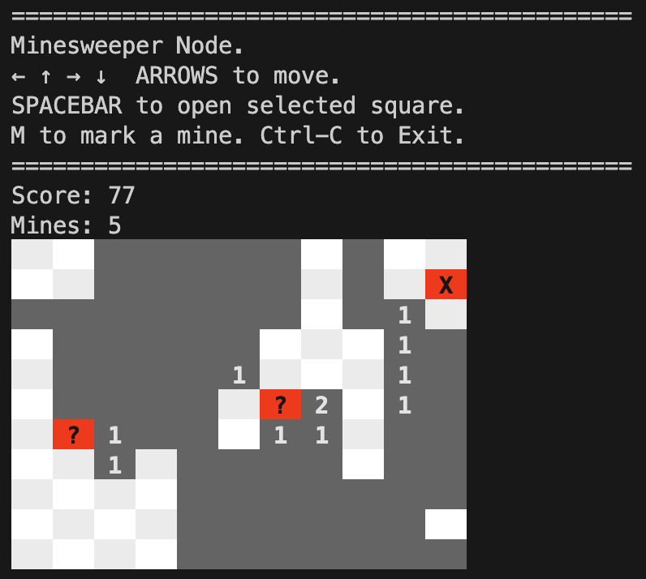

# Minesweeper
Minesweeper game. Play in the terminal

```
=============================================
Minesweeper Node.
← ↑ → ↓  ARROWS to move.
SPACEBAR to open selected square.
M to mark a mine. Ctrl-C to Exit.
=============================================
 ``` 
 