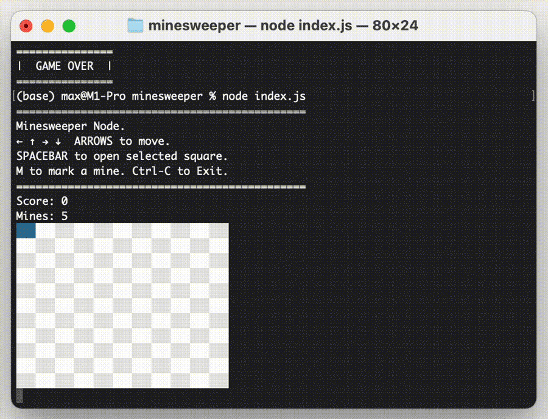

# Minesweeper Node.JS
Minesweeper game. 
Play in the terminal. 

Run:
```
node index.js
```
Controlls:
```
=============================================
Minesweeper Node.
← ↑ → ↓  ARROWS to move.
SPACEBAR to open selected square.
M to mark a mine. Ctrl-C to Exit.
=============================================
 ```
Preview:


